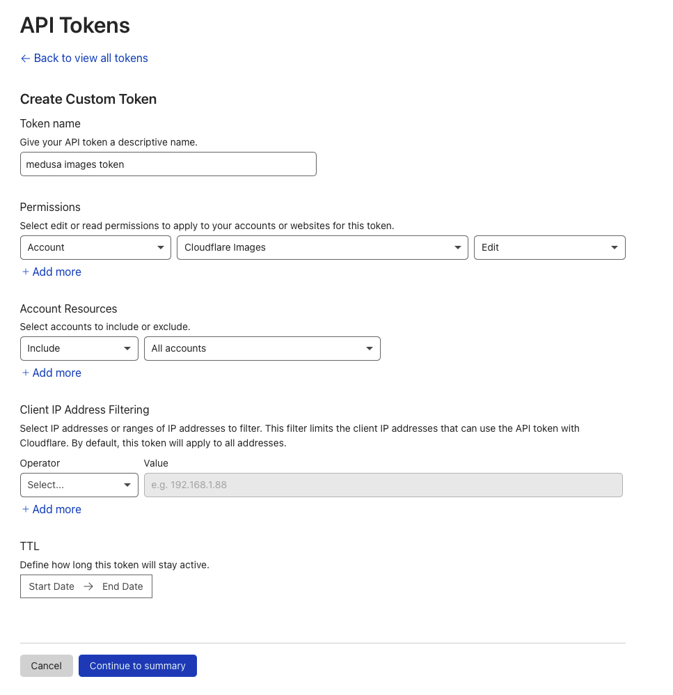

# Medusa File Cloudflare Images

Upload files to the Cloudflare images service.

## Description
This plugin is designed to extend off of the medusa commerce engine and provide a file connector to be able to upload images to Cloudflare images.

This plugin is written in Typescript and uses ESBuild to create the bundle and files needed to be included in the `medusa.config.js`

## Installation
```bash
npm install medusa-file-cloudflare-images
```

## Usage
Open your `medusa.config.js` and add the below configuration

```js
module.exports = {
  plugins: [
    ...otherMedusaPlugins,
    {
      resolve: `medusa-file-cloudflare-images`,
      options: {
        accountId: process.env.CF_ACCOUNT_ID,
        apiToken: process.env.CF_IMAGE_API_TOKEN,
      },
    },
  ]
}
```

### `CF_ACCOUNT_ID`
The account ID that is associated with your account. You can find this by following the below:
1. Sign into your Cloudflare account.
2. Before selecting a website, click on the `Images` menu option ont the left hand side of the screen.
3. Under `Developer Resources` on the left, look for the mono-spaced value under `Account ID`

### `CF_IMAGE_API_TOKEN`
The API token that is going to be used to allow the plugin to upload images to the images service. YOu can create one by following the below:
1. Go the API Tokens section in your Cloudflare Dashboard: https://dash.cloudflare.com/profile/api-tokens
2. Click on the **Create Token** button
3. Scroll down and click on the **Get started** button next to the **Create Custom Token** option under the Custom token section.
4. Give your token a name such as `medusa images token`
5. Under permissions, give create a permission that has **Account** privileges. Find **Cloudflare Images** in the dropdown and provide the token the ability to **edit**. See the image below:


6. Configure your API token the rest of the way that you want.
7. 